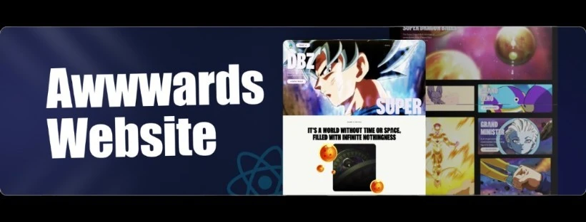

   
      
   

  

    
    
    
  

  <h3 align="center">Super Saiyan Scroll</h3>

## 📋 <a name="table">Table of Contents</a>

1. 🤖 [Introduction](#introduction)
2. ⚙️ [Tech Stack](#tech-stack)
3. 🔋 [Features](#features)

## <a name="introduction">🤖 Introduction</a>

Super Saiyan Scroll is an immersive web experience inspired by Dragon Ball Super, built using React, GSAP, and Tailwind CSS. It features smooth scroll animations, dynamic transitions, and high-energy visuals, making your browsing experience feel like unlocking Ultra Instinct!

## <a name="tech-stack">⚙️ Tech Stack</a>

⚛️ React.js – Component-based UI framework
🎭 GSAP – High-performance animations
🎨 Tailwind CSS – Utility-first styling
⚡ Vite – Lightning-fast frontend tooling

## <a name="features">🔋 Features</a>

🔥 Scroll-Based Animations – Dynamic effects triggered by scrolling
⚡ Energy-Powered Transitions – Inspired by DBZ’s high-speed action
💨 3D Hover Effects – Interactive transformations for an engaging UI
🎥 Cinematic Video Transitions – Seamless storytelling elements
📱 Fully Responsive – Optimized for all screen sizes
